# Keycloak – Client Authorization Grant Type - Configuration

This configuration procedure is specific to **OAuth2 Client Authorization Grant Sample Implementation**. This is to make the implementation works and anyone can play with it. 

## Pre-requisite

* Keycloak v21.0[^1]

  Do avoid too much configuration and if you can use docker container use the following command only for the first time:

  ```
  docker container run -d -e KEYCLOAK_ADMIN=admin -e KEYCLOAK_ADMIN_PASSWORD=admin123% -p 8080:8080 -p 8443:8443 --name keycloak keycloak/keycloak:21.0 start-dev
  ```
  
  > To **stop the container** use the following command:
  >
  > ```
  > docker container stop keycloak
  > ```
  
  > To **start the container** use the following command:
  >
  > ```
  > docker container start keycloak
  > ```

## Creating a New Client

1. **Sign in** to **keycloak admin console** using the following address:

   > Must know the a valid credential. 

   > If the docker command in the pre-requisite was used the credential is as follows:
   >
   > | Field    | Value     |
   > | -------- | --------- |
   > | Username | admin     |
   > | Password | admin123% |

   http://localhost:8080/admin/

2. **Create** a **new realm** named **myrealm** *(i.e. our realm for this sample)*: 

   1. **Click** the **dropdown** after the **current realm** *(i.e. master)*.

   2. **Click** the **Create Realm button**.

      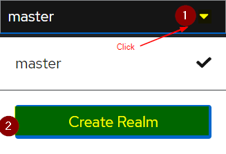

   3. **Fill-in** the **Realm name field** with **myrealm** *(i.e. the realm use in this sample implementation)*.

   4. **Click** the **Create button**.

      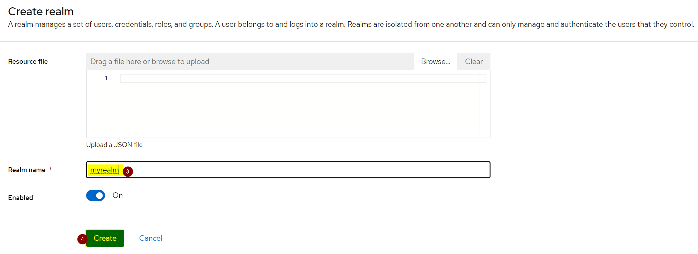

      > Expect to see that the current realm is now **myrealm**.

3. **Create** a **new client** as follows:

   1. **Click** the **Clients menu**.

   2. **Click** the **Create client button**.

   3. **Ensure** that **OpenID Connect** is the **Client type**.

   4. **Provide** a **Client ID** named **clientcredential** *(i.e. the client use in this sample implementation)*.

   5. **Click** the **Next button**.

      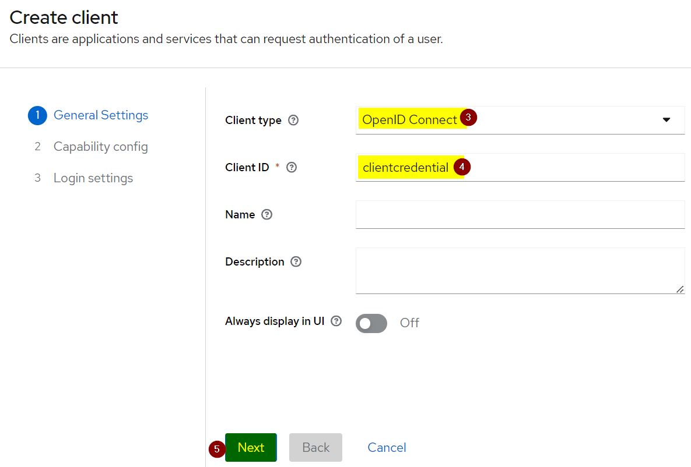

   6. **Enable Client authentication**.

   7. **Enable Authorization**.

   8. In the **Authentication flow**, **unselect** the following:

      * Standard flow
      * Direct access grants

   9. **Click** the **Next button**.

      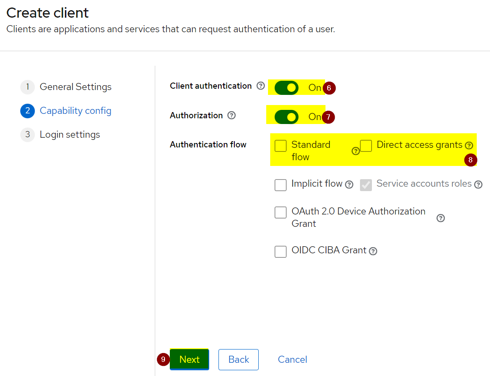

   10. **Click** the **Save button**.

       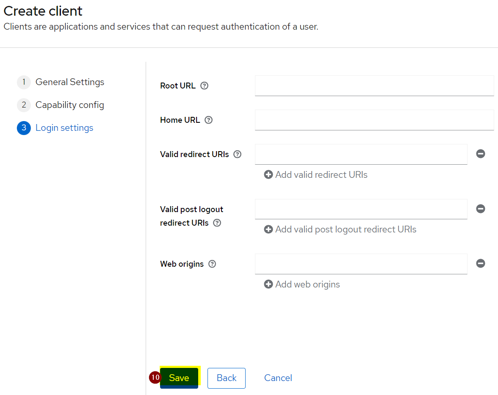


   11. **Click** the **Save password button**.

## Create an Audience Mapper

1. **Click** the **Client scopes menu**.

2. **Click** the **Create client scope button**.

3. **Give** it the name **clientcredential** *(i.e. the client scope use in this sample implementation)*.

4. **Click** the **Save button**.

5. **Click** the **Mappers tab**.

6. **Click** the **Configure a new mapper button**.

7. **Select Audience** from the mappings table.

8. Also **name** it as **clientcredential**.

9. **Select clientcredential** for the **Included Client Audience dropdown**.

10. **Enable** the **Add to access token**.

11. **Click** the **Save button**.

    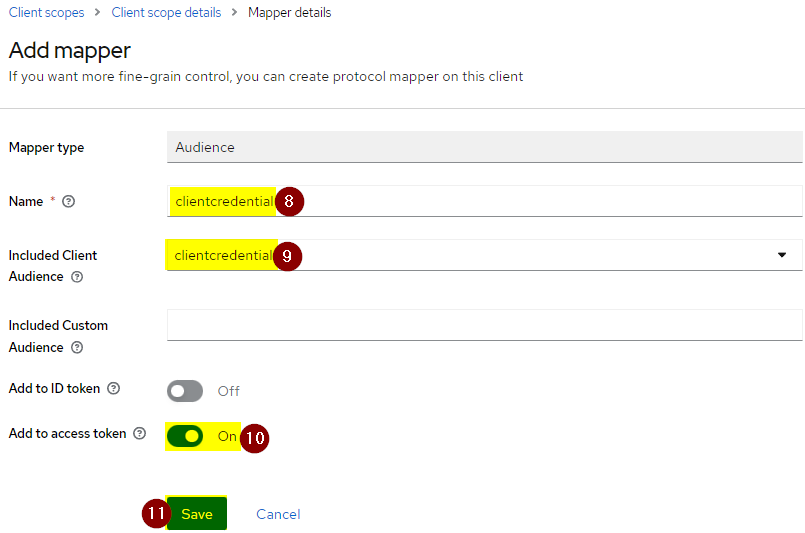

## Attaching the Audience to Client

1. **Click** the **Clients menu**.

2. **Load clientcredential**.

3. **Click** the **Client scopes tab**.

4. **Click** the **Add client scope button**.

5. **Check clientcredential** from the client scope list.

6. **Select Default** from the **Add dropdown**.

   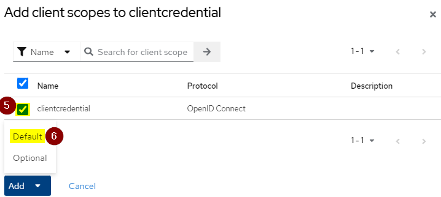

   > This will add clientcredential's clientId as one of the audiences.

## Identifying the Issuer

1. **Click** the **Realm settings menu** of **myrealm**.

   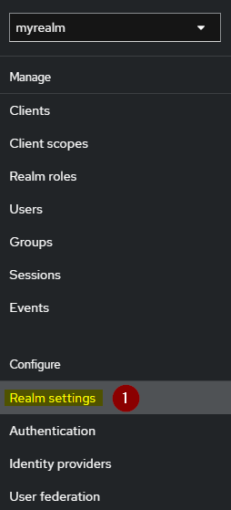

2. **Ensure** that the **General tab** is **active**.

3. At the **Endpoints section** click the **OpenID Endpoint Configuration**.

   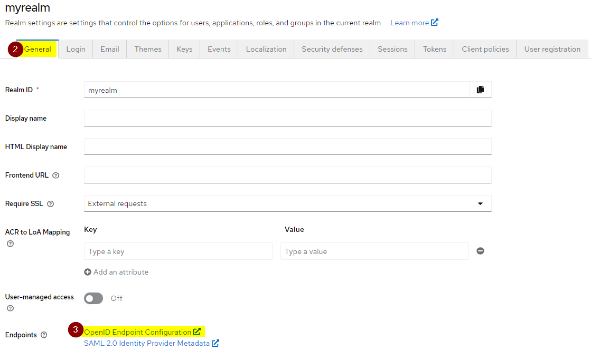

4. On the opened **browser**, you are interested in the **following entry**:

   * issuer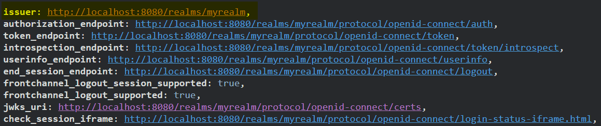
   

## Finding out the Client Secret

The **client secret** is needed when requesting for **authorization token** and **refreshing the access token**.

1. In **Keycloak**, **ensure** that you are in the **myrealm**.

2. **Load** the client **clientcredential**.

3. **Click** the **Credentials tab**.

4. **Look** for **Client secret**.

5. **Click** the **Copy icon** *(alternatively, you can display the secret by clicking the eye icon.)*.

   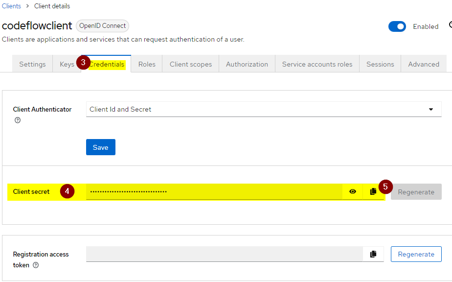

[Back](../README.md)

[^1]: https://www.keycloak.org/archive/downloads-21.0.0.html